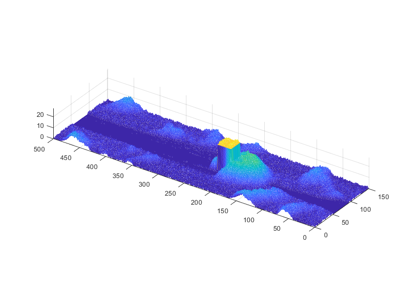
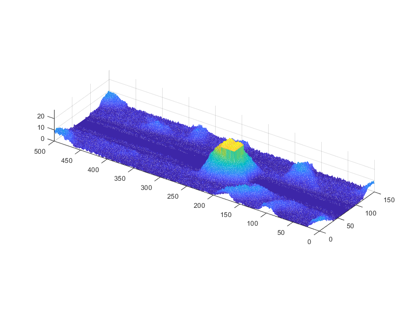
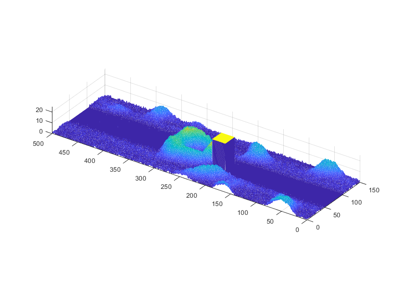
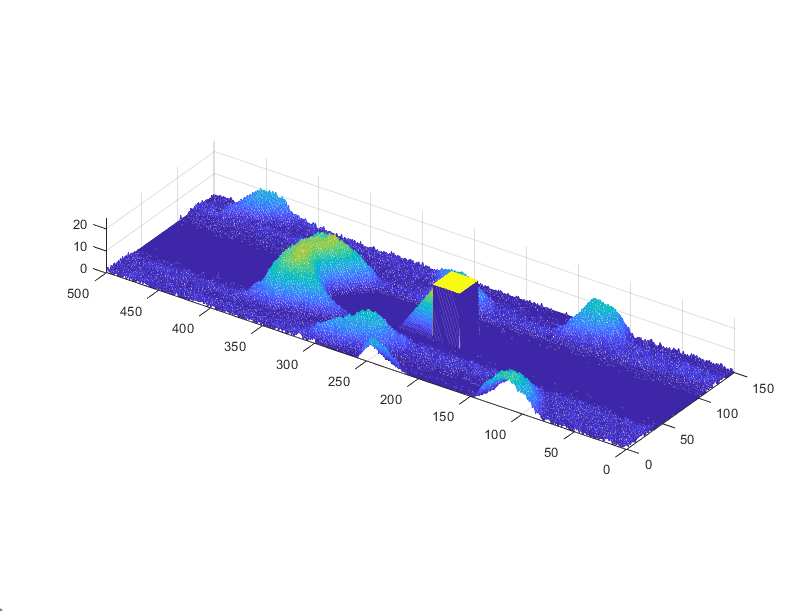

---

##### Download:

- [Paper](Dune_Modeling.pdf)

---

##### About:

This was a midterm project for the Introduction to Mathematical Modeling course (MATH 462) at the University of Michigan. 

---

##### Figure 7: Dune-obstacle interaction 

 $t=25$                     |                $t=50$            
:-------------------------:|:-------------------------------:
    |      

 $t=90$                     |                $t=125$            
:-------------------------:|:-------------------------------:
    |           

---

##### Animations

<figure style="width: 100%; max-width: 100%; margin: 0 auto;">
  

    <video style="position: absolute; top: 0; left: 0; width: 100%; height: 100%;" controls>
      <source src="DuneDifferentHeights.mp4" type="video/mp4">
    </video>
  

  <figcaption>Behavior of discrete desert dune field model by Bishop et. al (2002) for different initial amounts of sand $H_0$.</figcaption>
</figure>

<figure style="width: 100%; max-width: 100%; margin: 0 auto;">
  

    <video style="position: absolute; top: 0; left: 0; width: 100%; height: 100%;" controls>
      <source src="DuneObstacleHeatmap.mp4" type="video/mp4">
    </video>
  

  <figcaption>Top view of interaction of dunes and rectangular obstacles of height $h_{obs}$.</figcaption>
</figure>
