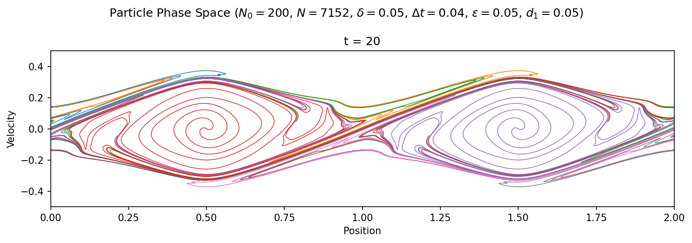
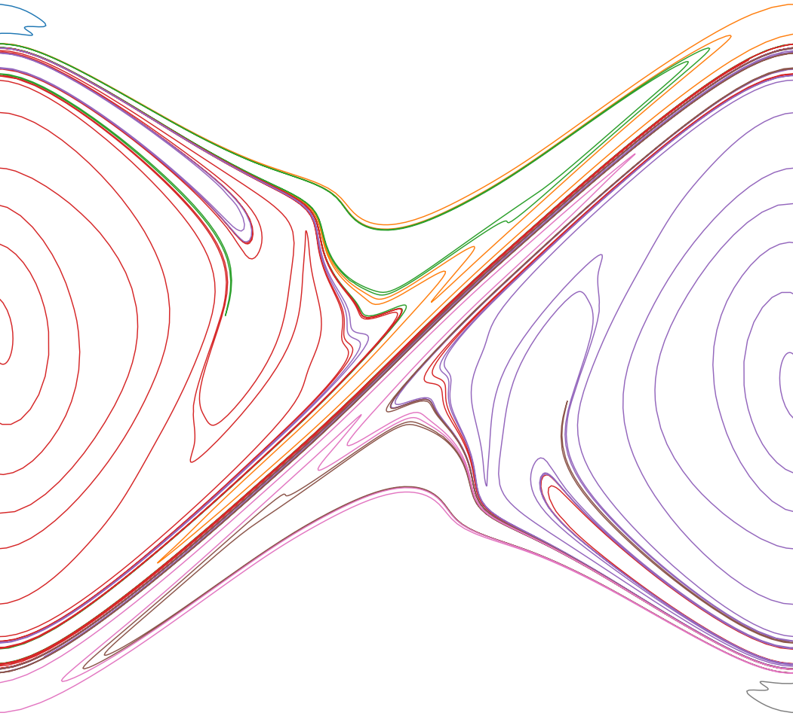

---

##### Download

+ [Paper](2023_REU.pdf)
+ [Code](https://github.com/horaciomorenom/PlasmaModel.git)

---

##### Abstract

The conventional approach to plasma simulations utilizes the particle-in-cell (PIC) method, but PIC simulations often lose resolution as complex features appear in the evolving plasma. This project develops an alternative Lagrangian particle method for a one-dimensional cold electrostatic plasma with periodic boundary conditions, which is both efficient and preserves accuracy as the plasma evolves in time, in contrast to existing methods. The plasma is described by the Vlasov-Poisson equations for the electron distribution in phase space and the self-consistent electric field in physical space. The plasma is represented by discrete charged macro-particles (representing electrons) with a neutralizing constant background distribution of positively charged ions. Two integration techniques, Euler's method and fourth order Runge-Kutta, are used to evolve the electrons, and regularization is applied to ensure continuity of the electric field. We investigate the effect of the numerical parameters, including the time step $\Delta t$, number of particles $N$, and the regularization parameter $\delta$. Initial results indicate that the lack of continuity in the non-regularized problem contributes to error growth for both integration schemes. Additionally, a particle insertion scheme is implemented to preserve the resolution of the plasma. Future extensions of this work seek to apply the method to study other distributions, like the two-stream instability and warm distributions, and further investigate the effects of electric field regularization regarding energy conservation and charge transport.

---

##### Figure 14: Phase space plot of plasma with particle insertion for two periods.

---

##### Figure 15: Expanded plot of plasma with particle insertion in region between two periods.

---

##### Animations

<figure style="width: 100%; max-width: 100%; margin: 0 auto;">
  

    <video style="position: absolute; top: 0; left: 0; width: 100%; height: 100%;" controls>
      <source src="insertion.mp4" type="video/mp4">
    </video>
  

  <figcaption>Animation of plamsa evolution with particle insertion, 200 initial particles for 20 seconds.</figcaption>
</figure>

---

##### Related material

+ [Presentation slides](REU_Presentation.pdf)
+ [Poster Presentation](SACNAS_poster.pdf)
