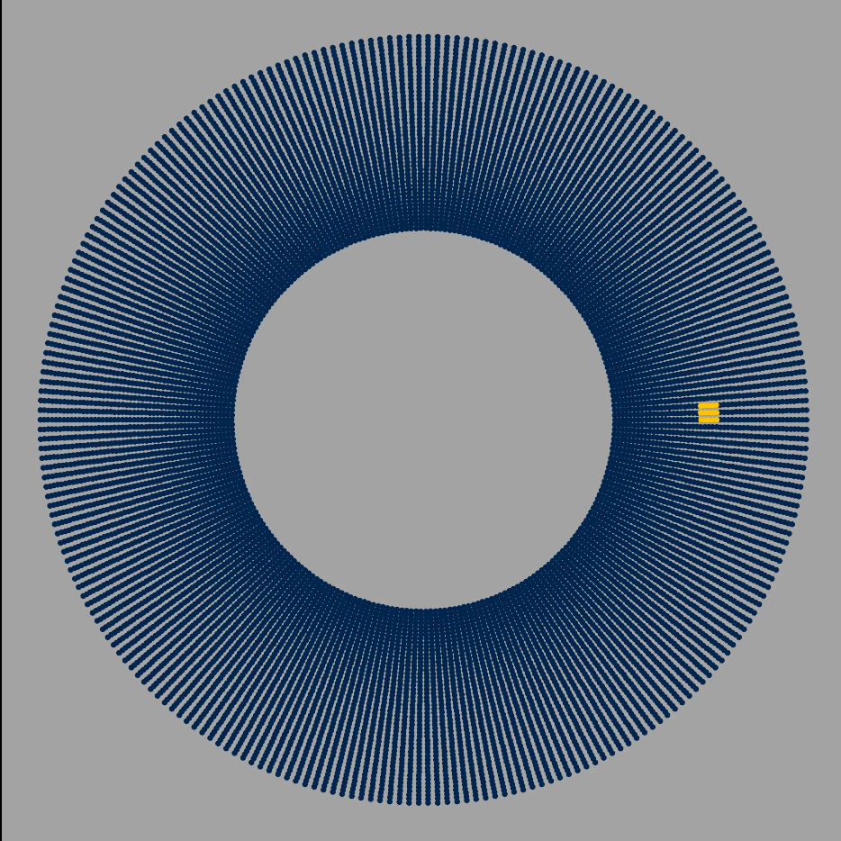
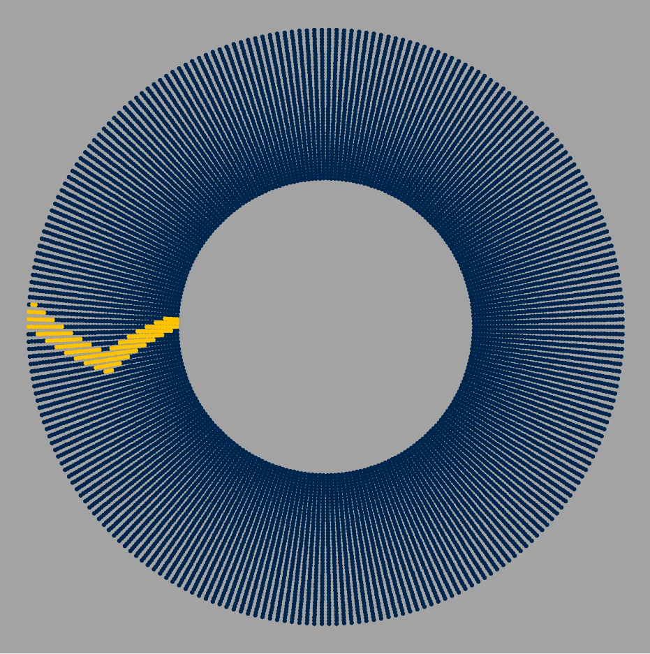

---

##### Download

+ [Paper](Modeling_Stadium_Waves.pdf)

---

##### Abstract

The wave is a common phenomenon at stadiums during sports events. During Michigan football season, it is hard to attend a game without participating in the wave around the Big House at least once. Inspired by this experience, this project aims to model the behavior of people in thestadium doing the wave. Our model follows the basic concepts of an agent-based, directed Social Network Model where people are modeled as nodes and have certain levels of influence from other nodes. Our motivation is to model human behavior and influence when there is a large number of people in a confined space.The question we aim to answer is: What initial number of people and in what arrangement does it take for the entire stadium to be participating? We define the entire stadium as participating as everyone in a column standing up while the wave is traveling in a complete round back to its initial position.

---

##### Figure 4: Evolution of a 3x5 initial wave
 
 $t=0$                     |                $t=21$            |  $t=42$  
:-------------------------:|:-------------------------------:|:-----------------:
    |          | 

---

##### Animations

<figure style="width: 100%; max-width: 100%; margin: 0 auto;">
  

    <video style="position: absolute; top: 0; left: 0; width: 100%; height: 100%;" controls>
      <source src="threshold_wave.mp4" type="video/mp4">
    </video>
  

  <figcaption>Different wave propagations with identical initial conditions with varying "transportation" thresholds $h$.</figcaption>
</figure>

<figure style="width: 100%; max-width: 100%; margin: 0 auto;">
  

    <video style="position: absolute; top: 0; left: 0; width: 100%; height: 100%;" controls>
      <source src="threshold_low.mp4" type="video/mp4">
    </video>
  

  <figcaption>An interesting animation of what happens when the wave threshold is extremelly low!</figcaption>
</figure>

